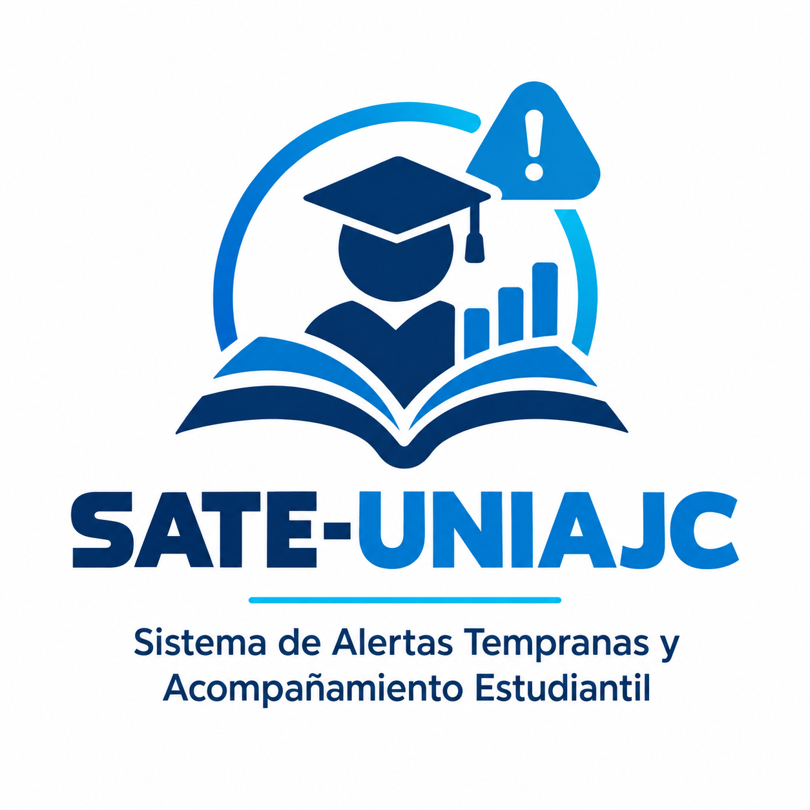

# SATE-UNIAJC

## Equipo Scrum

**Equipo Scrum SATE-UNIAJC**

### Integrantes

| Nombre completo | Usuario GitHub | Rol |
|---|---|---|
| Darwin Alexander Valencia Flor | @darwinvf2765 | Product Owner (PO) |
| Juan David Rosero Guerrero | @JuanRGuerrero | Scrum Master (SM) |
| Jeremy Andrey Agreda Rosero | @jere1927 | Developer 1 |

---
## Logo

---

## Descripción del proyecto

**SATE-UNIAJC (Sistema de Alertas Tempranas y Acompañamiento Estudiantil)** es una solución de software orientada al seguimiento y acompañamiento de los estudiantes de la Institución Universitaria Antonio José Camacho.

El sistema busca facilitar la identificación de situaciones que puedan afectar el desempeño y la permanencia estudiantil, permitiendo gestionar información relevante y generar alertas tempranas que contribuyan a brindar un acompañamiento oportuno.

---

## Visión del producto

La visión de **SATE-UNIAJC** es proporcionar una herramienta tecnológica que permita identificar oportunamente factores de riesgo académico y facilitar el acompañamiento de los estudiantes, contribuyendo a mejorar su desempeño, permanencia y experiencia dentro de la institución.

El producto busca centralizar la información necesaria para apoyar la toma de decisiones y fortalecer las estrategias de acompañamiento estudiantil mediante el uso de tecnología.

---

## Objetivo

Desarrollar un sistema que permita gestionar información estudiantil y apoyar la identificación de posibles situaciones de riesgo, proporcionando información útil para realizar un acompañamiento oportuno.

---

## Tecnologías

- Java
- Spring Boot
- Maven
- MySQL
- HTML
- CSS
- JavaScript
- Git
- GitHub

---

## Control de versiones

El proyecto utiliza **Git y GitHub** para el control de versiones y el trabajo colaborativo del equipo Scrum.

---

## Equipo Scrum SATE-UNIAJC

**Institución Universitaria Antonio José Camacho**

**Asignatura:** Ingeniería de Software I

**Sprint actual:** Sprint 1